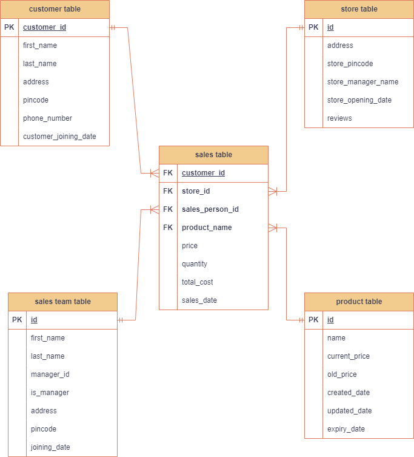

# ETL Pipeline README
## Architecture:

## Overview
This ETL (Extract, Transform, Load) pipeline processes sales data from S3 buckets, enriches it with data from various dimension tables, and stores the final results back into S3 and MySQL. The process includes downloading files from S3, validating schemas, transforming the data, and generating data marts for reporting.

## Directory Structure
```plaintext
├── docs/
│   └── readme.md
├── resources/
│   ├── __init__.py
│   ├── dev/
│   │    ├── config.py
│   │    └── requirement.txt
│   └── qa/
│   │    ├── config.py
│   │    └── requirement.txt
│   └── prod/
│   │    ├── config.py
│   │    └── requirement.txt
│   ├── sql_scripts/
│   │    └── table_scripts.sql
├── src/
│   ├── main/
│   │    ├── __init__.py
│   │    └── delete/
│   │    │      ├── aws_delete.py
│   │    │      ├── database_delete.py
│   │    │      └── local_file_delete.py
│   │    └── download/
│   │    │      └── aws_file_download.py
│   │    └── move/
│   │    │      └── move_files.py
│   │    └── read/
│   │    │      ├── aws_read.py
│   │    │      └── database_read.py
│   │    └── transformations/
│   │    │      └── jobs/
│   │    │      │     ├── customer_mart_sql_transform_write.py
│   │    │      │     ├── dimension_tables_join.py
│   │    │      │     ├── main.py
│   │    │      │     └──sales_mart_sql_transform_write.py
│   │    └── upload/
│   │    │      └── upload_to_s3.py
│   │    └── utility/
│   │    │      ├── encrypt_decrypt.py
│   │    │      ├── logging_config.py
│   │    │      ├── s3_client_object.py
│   │    │      ├── spark_session.py
│   │    │      └── my_sql_session.py
│   │    └── write/
│   │    │      ├── database_write.py
│   │    │      └── parquet_write.py
│   ├── test/
│   │    ├── scratch_pad.py.py
│   │    └── generate_csv_data.py
```

## Prerequisites
- Python 3.x
- Necessary Python packages: boto3, pymysql, pyspark, pandas, etc.
- AWS credentials with appropriate permissions to access S3 and RDS.
- Existing JDK > 8, Hadoop, Spark ~ Home directories must be present in `PATH` variable.
- Miniumn 4 GB of RAM, i3 and above. (8 GB mem / i5 is preffered for minimal performance.)
- MySQL database with necessary tables and permissions.

## Configuration
Configuration is managed in the `config.py` file under `resources/dev/`. It includes:
- AWS credentials.
- S3 bucket and directory paths.
- MySQL database connection details.
- File and directory paths for local and S3 storage.

## Encrypting AWS Credentials
AWS service keys and secrets must be encrypted for security. Use the `encrypt(raw)` and `decrypt(raw)` functions from `src/main/utility/encrypt_decrypt.py` to handle encryption and decryption.

### Encrypt AWS Keys
```python
from src.main.utility.encrypt_decrypt import encrypt

# Encrypt AWS keys
encrypted_access_key = encrypt('your_aws_access_key')
encrypted_secret_key = encrypt('your_aws_secret_key')
```

### Decrypt AWS Keys
```python
from src.main.utility.encrypt_decrypt import decrypt

# Decrypt AWS keys
decrypted_access_key = decrypt(encrypted_access_key)
decrypted_secret_key = decrypt(encrypted_secret_key)
```

## Generating Test Data
Test data can be generated using various scripts located in `src/test/`. These scripts create both valid and malformed CSV files for testing the pipeline's robustness.

### Generating Valid and Malformed CSV Data
1. **Generate Standard CSV Data**:
    ```bash
    python src/test/generate_csv_data.py
    ```

2. **Generate CSV with Fewer Columns**:
    ```bash
    python src/test/less_column_csv_generated_data.py
    ```

3. **Generate Date-Wise Sales Data**:
    ```bash
    python src/test/generate_datewise_sales_data.py
    ```

4. **Generate Customer Table Data**:
    ```bash
    python src/test/generate_customer_table_data.py
    ```

5. **Generate CSV with Extra Columns**:
    ```bash
    python src/test/extra_column_csv_generated_data.py
    ```

### Uploading Generated CSV Data to S3
After generating the test data, upload the CSV files to the designated S3 bucket using the following script:

### Schema


### Enriching the database with required tables
After installing SQL server, you need to run the queries present in `resources/sql_scripts/table_scripts.sql` to enrich the DB with these tables. `HeidiSQL` users might get some errors while executing these queries, but this can be solved by adding `DEFAULT NULL` to the column query.

```bash
python src/test/sales_data_upload_s3.py
```

## Workflow
1. **Retrieve AWS Access Keys**: Decrypt AWS access keys.
2. **Create S3 Client**: Initialize S3 client using decrypted keys.
3. **List Buckets**: List all buckets to verify the connection.
4. **Check Last Run Status**: Check if there are any failed files from the last run.
5. **List Files in S3**: List files in the S3 source directory.
6. **Download Files from S3**: Download files to the local directory.
7. **Validate File Schemas**: Ensure all required columns are present in the CSV files.
8. **Move Invalid Files**: Move files with missing columns to an error folder.
9. **Update Staging Table**: Insert details of the files to be processed into the staging table.
10. **Process CSV Files**: Read CSV files, handle extra columns, and concatenate if necessary.
11. **Enrich Data**: Join with dimension tables to enrich the data.
12. **Generate Data Marts**:
    - **Customer Data Mart**: Aggregated customer data.
    - **Sales Team Data Mart**: Aggregated sales team data.
13. **Write Data**:
    - Write enriched data to local Parquet files.
    - Upload Parquet files to S3.
    - Write partitioned data for reporting.
14. **Calculations**:
    - **Customer Mart Calculations**: Total purchases per customer per month.
    - **Sales Mart Calculations**: Total sales per salesperson per month.
15. **Move Processed Files**: Move processed files within S3.
16. **Clean Up**: Delete local files after processing.
17. **Update Staging Table**: Update the status of processed files in the staging table.

## Running the Pipeline
To run the pipeline, execute the main script. Make sure all configurations are set correctly in the `config.py` file.

```bash
python main.py
```

## Logging
Logs are generated at each significant step of the process for monitoring and debugging purposes. Ensure the logging configuration is set up correctly in `logging_config.py`.

## Error Handling
- **Missing Columns**: Files with missing required columns are moved to an error folder.
- **Download Errors**: Any issues during the file download process are logged, and the script exits.
- **Schema Validation**: Files with incorrect schemas are logged and handled separately.
- **Database Errors**: Issues with database connections or queries are logged, and the script exits gracefully.

## Conclusion
This ETL pipeline efficiently processes and enriches sales data, generating valuable data marts for reporting and analysis. It ensures data integrity and handles errors gracefully, providing robust logging for monitoring and troubleshooting.
